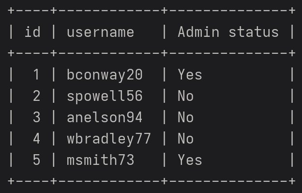

# Coporate Inventory Management System
This project is an inventory and employee management system designed for the company LOB which produces computer micro components. It features the ability to register users and update their information while keeping track of which employees work at which plants along with the ability to update and change inventory securely. It's built with Node.js, angular, and typescript. 
## Prerequisites

Please ensure you have the following installed before following the steps, or else it will not run
### Linux 
1. docker
2. docker compose
3. docker buildx
4. git

### Windows 
1. docker desktop
2. git

## How to install 

### Linux/Windows
Follow the steps below to set up the project
1. open a terminal in the location you wish to have this project, and clone the repository with git\
`git clone https://github.com/SouthHills/it237-project-dleitch00.git`
2. cd into the directory `cd it237-project-dleitch00/`
3. change the contents of the example.env file with a good password `nano example.env`
4. For linux: rename the example.env file to .env `mv example.env .env`
    - For windows: use the command `rename example.env .env`
5. run the command `docker compose up` and wait until you see `server | data source has been initialized`
6. open a browser and navigate to `localhost:80`
7. here you will click `register user` 
8. Reference the table below and enter the details accordingly, you will create the password, admins can see everything

9. Go back to the login page and enter your username and password

to close the docker containers use `docker compose down`
> [!IMPORTANT]
> Any changes you made will persist even after shutting down. if you wish to reset everything back to when you downloaded the project, use `docker compose down -v`

## PLanned Features
EXAMPLE 
- [ ] https://github.com/SouthHills/it237-project-dleitch00/issues/9

